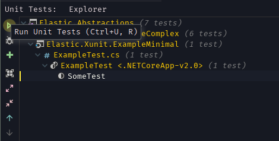

# Elastic.Xunit

Write integration tests against Elasticsearch `2.x`, `5.x` and `6.x`.
Works with `.NET Core` and `.NET 4.6` and up.

Supports `dotnet xunit`, `dotnet test`, `xunit.console.runner` and tests will be runnable in your IDE through VSTest and jetBrains Rider.


## Getting started

**NOTE:** `Elastic.Xunit` supports both .NET core and Full Framework 4.6 and up. The getting started uses the new csproj
from core but you can also use a full framework project.

### Create a class library project

```xml
<Project Sdk="Microsoft.NET.Sdk">
  <PropertyGroup>
    <TargetFrameworks>netcoreapp2.0</TargetFrameworks>
  </PropertyGroup>
  <ItemGroup>
    <DotNetCliToolReference Include="dotnet-xunit" Version="2.3.0-beta1-build3642" />
  </ItemGroup>
  <ItemGroup>
    <PackageReference Include="Elastic.Xunit" Version="<latest>" />
    <!-- Add the following if you want to run tests in your IDE (Rider/VS/Code) -->
    <PackageReference Include="xunit.runner.visualstudio" Version="2.3.1" />
    <PackageReference Include="Microsoft.NET.Test.Sdk" Version="15.5.0" />
    
    <!-- Optional, use a decent assertions library :)  -->
    <PackageReference Include="FluentAssertions" Version="5.1.2" />
  </ItemGroup>
</Project>
```

When using `.NET core` `dotnet xunit` is preferred over `dotnet test` the first will output a lot of useful 
information about the clusters that get started.

### Use Elastic.Xunit's test framework

Add the following Assembly attribute anywhere in your project. This informs Xunit to use our 
test framework to orchestrate and discover the tests.

```csharp
[assembly: Xunit.TestFrameworkAttribute("Elastic.Xunit.Sdk.ElasticTestFramework", "Elastic.Xunit")]
```

### Create a cluster

This is the cluster that we'll write our integration test against. You can have multiple cluster. 
`Elastic.Xunit` will only ever start one cluster at a time and then run all tests belonging to that cluster. 

```csharp
/// <summary> Declare our cluster that we want to inject into our test classes </summary>
public class MyTestCluster : XunitClusterBase
{
	/// <summary>
	/// We pass our configuration instance to the base class.
	/// We only configure it to run version 6.2.3 here but lots of additional options are available.
	/// </summary>
	public MyTestCluster() : base(new XunitClusterConfiguration("6.2.0")) { }
}
```

### Create a test class

```csharp
public class ExampleTest : IClusterFixture<MyTestCluster>
{
	public ExampleTest(MyTestCluster cluster)
	{
		// This registers a single client for the whole clusters lifetime to be reused and shared.
		// we do not expose Client on the passed cluster directly for two reasons
		//
		// 1) We do not want to prescribe how to new up the client
		//
		// 2) We do not want Elastic.Xunit to depend on NEST. Elastic.Xunit can start 2.x, 5.x and 6.x clusters
		//    and NEST Major.x is only tested and supported against Elasticsearch Major.x.
		//
		this.Client = cluster.GetOrAddClient(c =>
		{
			var nodes = cluster.NodesUris();
			var connectionPool = new StaticConnectionPool(nodes);
			var settings = new ConnectionSettings(connectionPool)
				.EnableDebugMode();
			return new ElasticClient(settings);
		);
	}

	private ElasticClient Client { get; }

	/// <summary> [I] marks an integration test (like [Fact] would for plain Xunit) </summary>
	[I] public void SomeTest()
	{
		var rootNodeInfo = this.Client.RootNodeInfo();

		rootNodeInfo.Name.Should().NotBeNullOrEmpty();
	}
}

```

### Run your integration tests!



When using `.NET core` `dotnet xunit` is preferred over `dotnet test` the first will output a lot of useful 
information about the clusters that get started.


